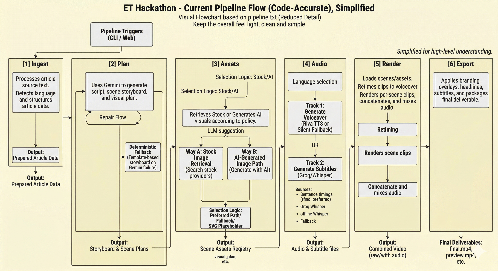
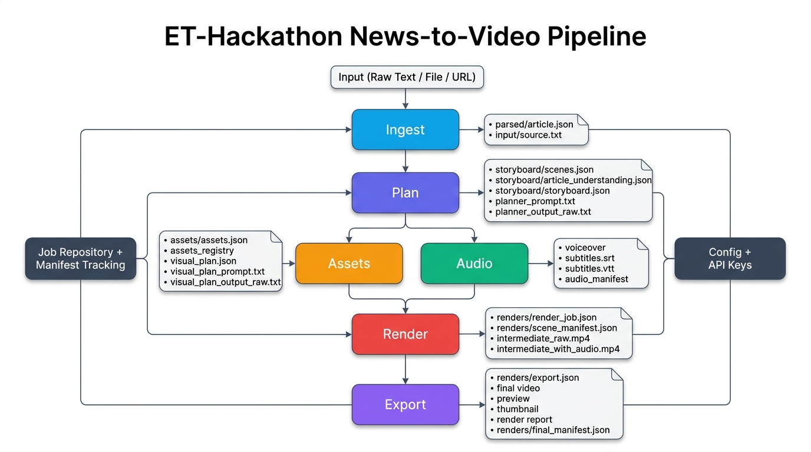

# ET Hackathon: News-to-Video Automation Pipeline

Turn a news article into a publish-ready vertical video reel using a staged AI pipeline:

- Ingest article text from raw input, file, or URL
- Plan a newsroom-style scene script with Gemini + deterministic fallback
- Resolve visuals with stock search and AI image generation fallback
- Generate voiceover and subtitles
- Render scene composition
- Export final, preview, thumbnail, and reports

## Project Objective

This project automates short-form news video creation for editorial workflows. It is designed as a production-like, schema-first pipeline with stage tracking, artifacts, retries, and structured logs.

## Pipeline Flow



## Flowchart
<!-- 
Main pipeline flowchart (add your final image file later):

 -->

<!-- Gemini-generated flowchart: -->



## What This Project Uses

### Languages and Frameworks

- Python 3.10+ for the pipeline
- Typer CLI for stage commands
- Pydantic for strict data contracts
- Next.js (React) for the web UI shell

### AI and Media Tooling

- Gemini (script planning and visual planning)
- SerpAPI (Google Images discovery)
- Pexels API (stock image fallback)
- ClipDrop Text-to-Image (AI visual generation fallback)
- NVIDIA Riva (TTS voice synthesis)
- Groq Whisper API (STT timing for subtitles)
- Offline Whisper fallback (when Groq is unavailable)
- FFmpeg + FFprobe (render/export/transcode/media probing)

### Python Dependencies

From pyproject.toml/requirements.txt:

- pydantic
- jsonschema
- typer
- rich
- python-dotenv
- requests
- google-genai
- openai
- groq
- nvidia-riva-client
- soundfile
- openai-whisper
- langid

## End-to-End Pipeline

Stage order is fixed and enforced:

1. ingest
2. plan
3. assets
4. audio
5. render
6. export

### 1) Ingest

- Reads source from local file, URL, or raw text
- Normalizes text and auto-detects language
- Persists `parsed/article.json` and `input/source.txt`

### 2) Plan

- Builds 90-second scene storyboard JSON
- Uses Gemini when `GEMINI_API_KEY` is set and run is not dry-run
- Repairs malformed JSON provider output when needed
- Falls back to deterministic template plan if LLM is unavailable
- Can merge visual suggestions from a second Gemini key
- Writes:
  - `storyboard/scenes.json`
  - `storyboard/article_understanding.json`
  - `storyboard/storyboard.json`
  - `storyboard/planner_prompt.txt`
  - `storyboard/planner_output_raw.txt`

### 3) Assets

- Reads planned scenes and visual suggestions
- Resolves visuals using SerpAPI with Pexels fallback
- Uses ClipDrop generation for selected scenes (min/max AI image policy)
- Validates image payloads and falls back to placeholder SVG if all providers fail
- Writes:
  - `assets/assets.json`
  - `assets/assets_registry.json`
  - visual plan artifacts

### 4) Audio

- Builds narration from scene script
- TTS via NVIDIA Riva when configured; otherwise silence fallback in dry-run/no-provider mode
- Subtitle timing strategy:
  - Hindi: deterministic sentence timing
  - Else: Groq word/segment timing when available
  - Fallback: offline Whisper, then sentence timing
- Writes:
  - `audio/voiceover.wav`
  - `audio/subtitles.srt`
  - `audio/subtitles.vtt`
  - `audio/audio_manifest.json`

### 5) Render

- Validates scenes and assets
- Builds scene manifest and transitions
- Renders intermediate videos with FFmpeg
- Writes:
  - `renders/render_job.json`
  - `renders/scene_manifest.json`
  - `renders/intermediate_raw.mp4`
  - `renders/intermediate_with_audio.mp4`

### 6) Export

- Produces final distribution outputs with FFmpeg
- Optional subtitle burn-in
- Optional branding overlays (header/logo), background video, and background music if found
- Writes:
  - `renders/export.json`
  - `renders/final.mp4`
  - `renders/preview.mp4`
  - `renders/thumbnail.jpg`
  - `renders/render_report.json`
  - `renders/final_manifest.json`

## Core Architecture

### Orchestration

- `main.py`: full-pipeline runner (ingest -> export)
- `src/cli.py`: Typer command per stage + stage wrapper for retries/status/logging

### Contracts and State

- `src/common/models.py`: strict schemas (`Article`, `Scene`, `Asset`, `RenderJob`, `Manifest`, etc.)
- `src/storage/repository.py`: job creation, stage status updates, artifact registration, manifest persistence
- `src/common/constants.py`: stage order and job directory layout

### Observability

- `src/observability/json_logger.py`: JSONL stage logs
- Stage events include started/completed/failed and metadata

## Repository Structure

```text
.
|- main.py
|- pyproject.toml
|- requirements.txt
|- src/
|  |- cli.py
|  |- ingest/stage0.py
|  |- planner/engine.py
|  |- assets/pipeline.py
|  |- audio/pipeline.py
|  |- renderer/pipeline.py
|  |- postprocess/exporter.py
|  |- storage/repository.py
|  |- common/{config,constants,models,validation,retry,errors}.py
|  |- observability/json_logger.py
|- web/
|  |- app/{layout.js,page.js,globals.css}
|  |- lib/jobStore.js
|  |- scripts/run_pipeline.js
|- Flowchart.png
```

## Configuration

Configuration is loaded from environment variables (`.env` supported by python-dotenv).

Key variables:

- General:
  - `LANGUAGE` (`english` or `hindi`)
  - `DURATION_SECONDS`
  - `ASPECT_RATIO`
  - `STYLE_PRESET`
  - `JOBS_ROOT`
  - `CACHE_ROOT`
- Planning:
  - `GEMINI_API_KEY`
  - `GEMINI_VISUAL_API_KEY`
  - `GEMINI_MODEL`
  - `NVIDIA_API_KEY`
- Asset providers:
  - `SERP_API_KEY`
  - `PEXELS_API_KEY`
  - `CLIP_DROP_API`
  - `REPLICATE_API_TOKEN` (present in config surface)
- Audio providers:
  - `NVIDIA_RIVA_API_KEY`
  - `NVIDIA_RIVA_FUNCTION_ID`
  - `NVIDIA_RIVA_URI`
  - `NVIDIA_RIVA_VOICE`
  - `NVIDIA_RIVA_LANGUAGE`
  - `GROQ_API_KEY`
  - `GROQ_BASE_URL`
  - `GROQ_MODEL`
  - `GROQ_STT_MODEL`
- Branding/Export optional:
  - `HEADER_IMAGE_PATH`
  - `ET_LOGO_PATH`
  - `BURN_SUBTITLES`
  - `FFMPEG_PRESET`
  - `FFMPEG_CRF`
  - `RENDER_FPS`

## Prerequisites

- Python 3.10+
- FFmpeg and FFprobe in PATH
- (Optional) Node.js 18+ for web UI
- API keys for enabled provider paths

## Setup

### 1) Python environment

```bash
python -m venv .venv
# Windows PowerShell
.\.venv\Scripts\Activate.ps1
pip install -r requirements.txt
```

### 2) Environment variables

Create `.env` in project root and set the variables you plan to use.

### 3) Optional web UI setup

```bash
cd web
npm install
npm run dev
```

## Running the Pipeline

### Full pipeline (recommended)

```bash
python main.py "<raw text | file path | URL>" --title "Optional title"
```

Dry run:

```bash
python main.py "<input>" --dry-run
```

### Stage-by-stage execution

```bash
python -m src.cli ingest "<input>" --title "Optional"
python -m src.cli plan <job_id>
python -m src.cli assets <job_id>
python -m src.cli audio <job_id>
python -m src.cli render <job_id>
python -m src.cli export <job_id>
```

## Job Outputs and Artifacts

Each run creates `jobs/<job_id>/` with structured subdirectories:

- `input/`
- `parsed/`
- `storyboard/`
- `assets/`
- `audio/`
- `renders/`
- `logs/`

Persistent job state includes:

- `job_state.json` (current/completed stage info)
- `manifest.json` (stage metadata + artifact map)

## Web UI Notes

The current web frontend (`web/app/page.js`) is designed to:

- Accept article text
- Poll job status and stage progression
- Show final preview when available

A helper script exists at `web/scripts/run_pipeline.js` to run Python stages for an existing job id.

## Reliability and Safeguards

- Schema validation at stage boundaries
- Retry wrapper per stage
- Provider fallback chains in planning/assets/audio
- Placeholder visual fallback when all image providers fail
- Structured JSON logs for troubleshooting

## Utility Scripts in Root

The repository includes helper/testing scripts such as:

- `create_fallback_audio.py`
- `create_fallback_storyboard.py`
- `fix_render.py`
- `simple_fix_render.py`
- `update_assets_registry.py`
- `test_api_config.py`
- `test_groq_api.py`

These are useful for diagnostics and quick recovery workflows during development/hackathon iteration.

## Hackathon Value Proposition

- Fast article-to-video turnaround
- Multi-provider resilience with graceful degradation
- Clear stage contracts and reproducible artifacts
- Demo-friendly outputs (final + preview + thumbnail + reports)
- Ready foundation for production hardening

<!-- ## Suggested Demo Walkthrough

1. Paste article text.
2. Run full pipeline.
3. Show stage-by-stage progression.
4. Open generated artifacts in each folder.
5. Play `final.mp4` and `preview.mp4`.
6. Show `render_report.json` and `manifest.json` as proof of traceability. -->
